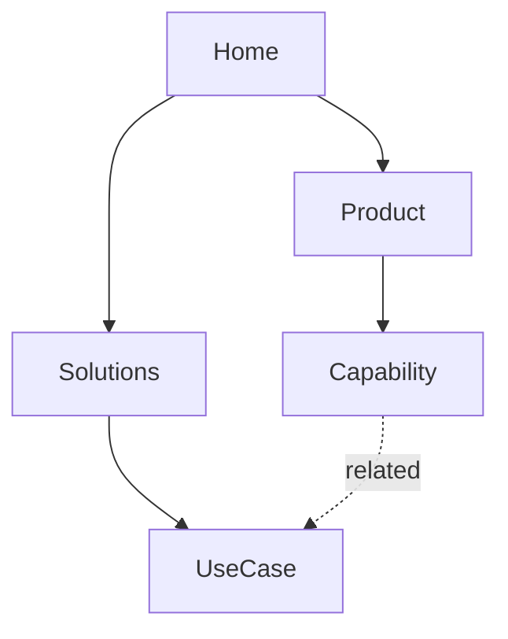

# Architecture system

## Starting models

- product or SaaS: product, use case, capability, integration, comparison, proof, pricing, resources, and documentation;
- ecommerce: category, collection, product, brand, guide, account, policy, and support;
- marketplace or directory: taxonomy, listing, provider, location, comparison, and contribution;
- publisher or knowledge site: topic, series, article, author, archive, glossary, and resource;
- local or multi-location: service, location, service-location relationship, proof, booking, and policy;
- portfolio or service business: capability, sector, work, approach, proof, people, and contact.

Use only page types supported by real content, ownership, and audience value.

## Hierarchy

Map global entry points, major audience tasks, category or product relationships, parent-child rules, cross-cutting facets, support content, transactional surfaces, and account or application boundaries. Keep important pages reachable through meaningful links without flattening the whole site.

## Navigation

Define global, utility, local or section, contextual, footer, mobile, and in-product navigation. Use labels that predict destinations. Specify overflow, current state, keyboard behavior, responsive treatment, and governance for additions.

## URLs

Use stable, readable paths reflecting durable ownership rather than campaign phrasing or implementation details. Define case, separators, trailing slash, parameters, pagination, locale, canonical, redirects, reserved paths, and collision behavior.

## Visual sitemap

For simple sites, return an indented tree. Use Mermaid when relationships, cross-links, or states are materially easier to understand visually:

Annotate page type, owner, status, template, source, and migration when useful. The diagram does not replace the page inventory.

## Internal links

Define navigational, contextual, related-content, breadcrumb, hub, and transactional links. Specify source page type, destination relationship, anchor rule, maximum or selection logic, orphan detection, broken-link monitoring, and archival behavior.

## Restructure and migration

Inventory old URL, target URL, action, reason, content owner, redirect type, links to update, canonical and sitemap changes, analytics annotation, validation, and rollback or correction. Preserve high-value content and resolve duplicate targets before launch.

## Output

Return principles, page inventory, hierarchy, navigation model, URL conventions, visual sitemap, page-type contracts, internal-link rules, migration map, ownership, and validation plan.
